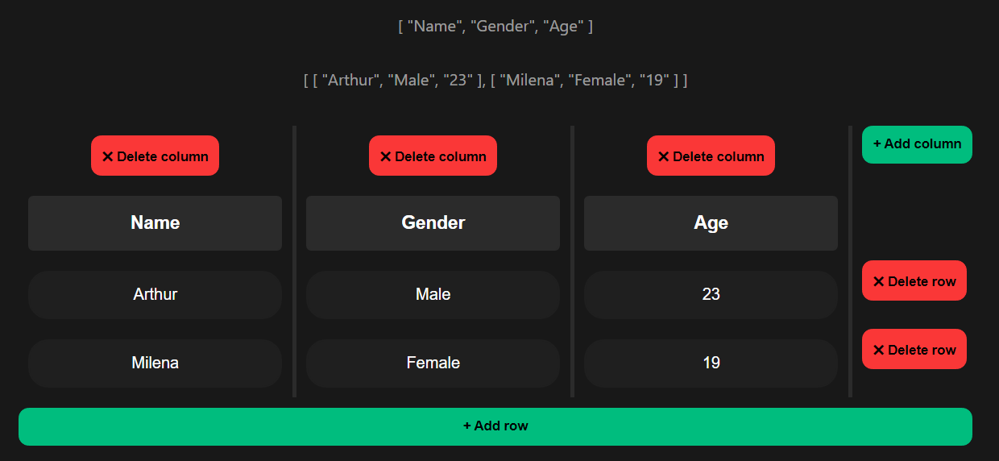

<h1 align="center">
    Vue Realtime Editable Dynamic Table
</h1>

---

__Change__, __edit__, __create__ a table fast, easy and in real time.





---
## How does it work?
With the help of the corresponding buttons, you change the dimensions of the array, and by entering data into the table fields, the values change, thanks to the view, and in the same way, a dynamic table is built in front of you, which takes data from the array.

---
## Why is it and how was it created?
I was doing a diploma project, namely a constructor of reports in accordance with standards, and I needed to develop a component that would graphically build a table, which would then be transferred to the backend and build a common table in the document, so I began to develop this dynamic table.

---
## Passed props
A complex array is transferred to the table, with which the logic in the table component operates, this is how it looks

```sh
dynamicTableData:
        {
            headersCount: 3,
            rowsCount: 2,
            headers: ["Header", "Header", "Header"],
            cellsData: [
              ["Cell", "Cell", "Cell"],
              ["Cell", "Cell", "Cell"],
            ],
        },
```
---

## Project Setup

```sh
npm install
npm run dev
npm run build
```

